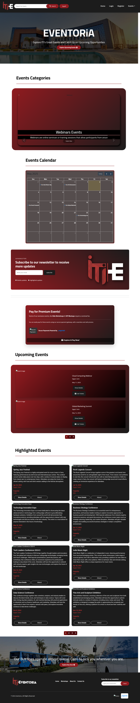
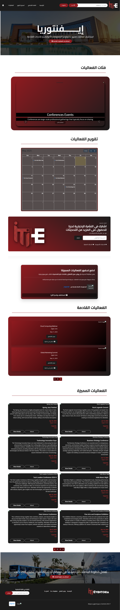
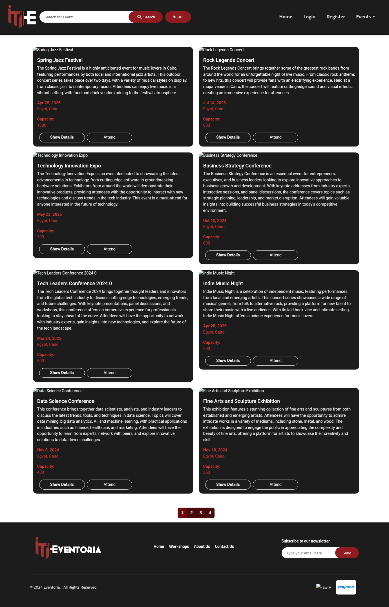
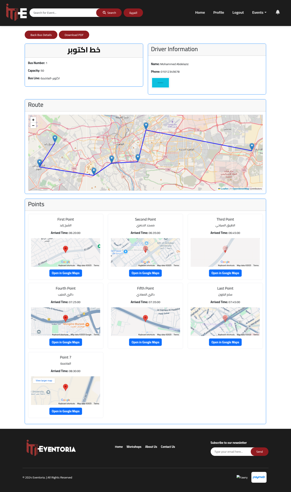
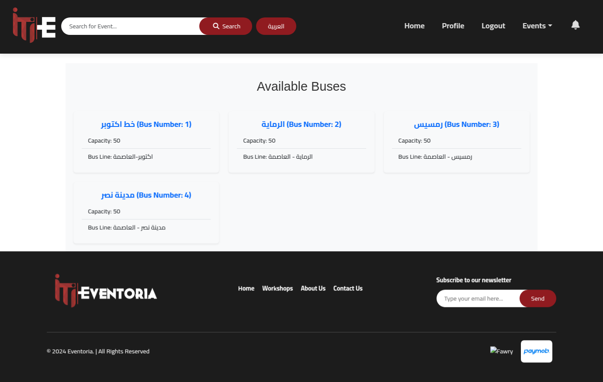
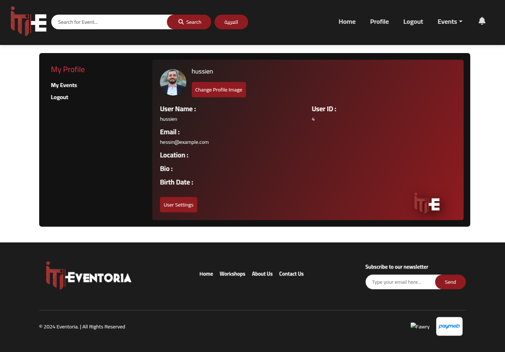
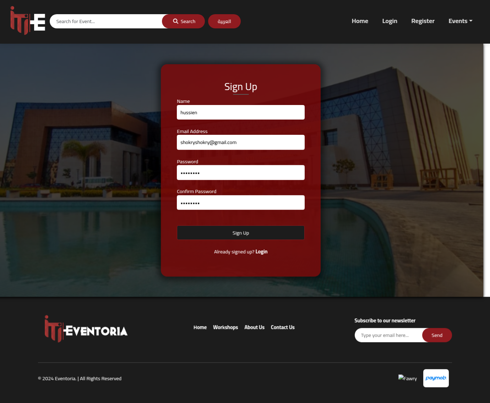
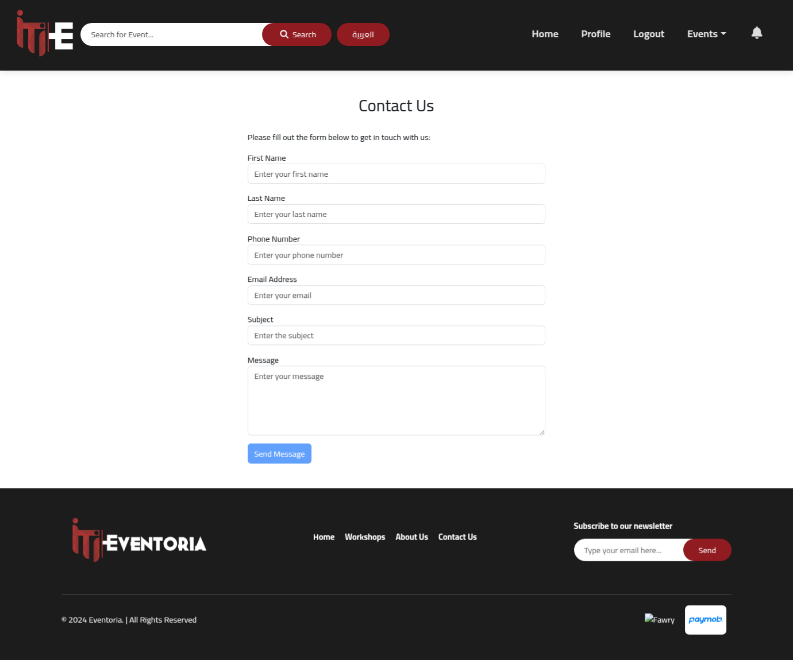

# Eventoria - Event Management Platform

Eventoria is a comprehensive event management platform built with Angular 17, offering a modern and intuitive interface for managing events, bus routes, and user interactions.

## 🚀 Features

- User Authentication & Authorization
- Event Management
- Bus Route Planning
- Multi-language Support
- User Profile Management
- Contact & Support
- Responsive Design

## 🛠️ Technologies Used

- Angular 17.3.8
- TypeScript
- Angular Material
- Bootstrap
- i18n for Internationalization

## 📸 Application Screenshots

### Landing Page

*The main landing page showcasing featured events and key platform features*

### Landing Page with Translation

*Demonstrating the multi-language support feature*

### Events Page

*Browse and search through various events*

### Bus Routes

*Interactive bus route planning and visualization*

### Available Buses

*View and manage available transportation options*

### User Profile

*Personalized user profile management*

### Registration

*User registration interface with form validation*

### About Us

*Learn more about Eventoria and our mission*

### Contact

*Get in touch with our support team*

## 🚀 Getting Started

1. Clone the repository
2. Install dependencies:
   ```bash
   npm install
   ```
3. Start the development server:
   ```bash
   ng serve
   ```
4. Navigate to `http://localhost:4200/`

## 🔧 Development Commands

- `ng serve` - Run development server
- `ng build` - Build the project
- `ng test` - Execute unit tests
- `ng e2e` - Execute end-to-end tests

## 📚 Additional Resources

For more information about Angular CLI, visit the [Angular CLI Overview and Command Reference](https://angular.io/cli) page.
